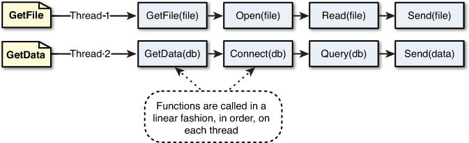

1. Node.js是什么
2. 为什么使用Node.js
3. 使用Node.js
4. Node.js应用场景

### 1. Node.js是什么

Node.js是基于 Chrome 的 V8 JavaScript 引擎构建的 JavaScript 运行时环境。


Node.js使得javaScript可以像其他后端语言如Java一样开发后端程序，对上层提供服务，对下层操作数据。
	

	

### 2. 为什么使用Node.js

```
	Node.js 使用事件驱动的非阻塞 I/O模型，轻量且高效。
	Node.js 的包生态系统 npm(Node package manager) 是世界上最大的开源库生态系统。
```

* 事件驱动
	
> 	前端事件 🆚 后端事件
	
```
	$("#myButton").click(function(){
     if ($("#myTextField").val() != $(this).val())
         alert("Field must match button text");
	});
```


>    传统webserver多线程处理机制 🆚 nodejs事件驱动机制
	
>>传统webserver多线程处理机制

>>> 在 Java、PHP 或者 .net 等服务器端语言中，会为每一个客户端连接创建一个新的线程。而每个线程需要耗费大约2MB内存。也就是说，理论上，一个8GB内存的服务器可以同时连接的最大用户数为4000个左右。要让Web应用程序支持更多的用户，就需要增加服务器的数量，而 Web 应用程序的硬件成本当然就上升了。

	

>>nodejs事件驱动机制

>>>Node.js不为每个客户连接创建一个新的线程，仅有一个线程。当有用户连接了，就触发一个内部事件，通过非阻塞I/O、事件驱动机制（包含事件循环），让 Node.js 程序宏观上也是并行的。使用 Node.js ，一个8GB内存的服务器，可以同时处理超过4万用户的连接。


* 非阻塞异步IO

	例如，当在访问数据库获取数据时，在传统的单线程处理机制中，在执行了访问数据库代码之后，整个线程都将暂停下来，等待数据库返回结果，才能执行后面的代码。也就是说，I/O会阻塞代码的执行，会降低了程序的执行效率。
	
	而Node.js的非阻塞I/O机制，是在执行访问数据库代码后，转而立即执行其后代码，把数据库返回结果的处理程序放在回调函数中。当该I/O执行完毕后，系统将事件的形式通知执行I/O操作的线程，线程进而执行这个事件的回调函数。
	


* 跨平台

	Node 基于libuv（一个高性能的,事件驱动的I/O库,并且提供了跨平台如windows, linux的API）实现跨平台。
	
* npm

	是Node的内置功能，用于安装和管理 Node 模块。可以通过npm安装任何依赖的模块，也可以通过npm发布自己编写的node扩展功能。


### 3. Node.js应用

1. 创建一个简单server

```
	scripts/dev.ts:
		app.listen(port, callback) 相当于是
		const http = require('http');
		const Koa = require('koa');
		const app = new Koa();
		http.createServer(app.callback()).listen(3000);
```

2. mock服务平台

	*	后端使用koa node web服务器框架 + cluster + pm2实现多线程利用多核cpu。

		* cluster

			v0.8版本之前，实现多进程可以使用child_process，在v0.8版本之后，可以使用cluster模块，通过主从模式，创建多个工作进程解决多核CPU的利用率问题。
	
		

	   * pm2(node服务管理工具)

			pm2特点有：内建负载均衡（使用 Node cluster 集群模块）；可后台运行；0 秒停机重载；控制台检测等。通过一些pm2命令可查看启动的进程列表、监控每个 node 进程的 cpu 和内存使用情况以及打印日志等。
	


### 4. Node.js应用场景
* 应用场景
* BFF Backends For Frontends(服务于前端的后端) serverless
	


* 哪些大公司在用
	
	1. 雅虎：雅虎开放了Cooktail框架，将YUI3这个前端框架的能力借助Node延伸到了服务器端。
	2. 腾讯：将Node应用到长连接，以提供实时功能。
	3. 花瓣网，蘑菇街：通过socket.io实现实时通知。
	4. 阿里：主要利用的是并行I/O这个性能，实现高效的分布式，它们自己也出了很多Node框架
	5. 网易：游戏领域对并发和实时要求很高，网易开源了Node的实时框架pomelo


